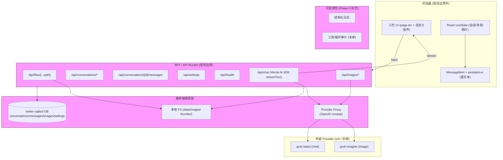

# Grok Studio 聊天应用架构审计报告

**审计日期**: 2026-09-18
**审计范围**: /Users/ray/Desktop/grok-lite (Next.js 项目)
**审计方法**: 只读文件系统检查、终端命令 (pwd, git, ls, wc, grep)、代码阅读 (read_file 沿聊天主链路)
**修改状态**: 审计期间未执行任何 search_replace、write 或依赖变更。所有操作仅读取。

## 1. 执行摘要

当前项目是一个本地运行的 "Grok 聊天 + 画图" 单体 Next.js 应用，使用 better-sqlite3 持久化会话、消息和图片资产。聊天链路采用客户端乐观更新 + 服务端 OpenAI 兼容流式代理 + ReadableStream 回传的模式。核心资产是符合个人习惯的三栏布局（会话列表 + 聊天 + 图片面板）、图片编辑链和本地文件落盘策略。

**主要发现**:
- 核心聊天可用（多轮、流式、停止、持久化），但缺少成熟聊天产品的基础渲染和交互能力（Markdown、复制、分支等）。
- 状态管理全为 React useState，无外部 store。
- 安全边界良好（Key 仅服务端），但存在不一致（summarize 硬编码 x.ai API）。
- 质量保障缺失（无测试、无 E2E、无日志）。
- 推荐策略：**保持手搓 UI 架构（保护现有交互习惯）**，引入 Vercel AI SDK 标准化模型调用层，局部引入富文本渲染库，按阶段补齐 P0/P1 缺口。 不推荐整体迁移到任何完整聊天产品或重度框架。

**风险等级**: 中低。核心功能稳定，改造可逆性高。

## 2. 当前项目审计结果

### 2.1 目录结构与技术栈（已由 list_dir + read_file 证实）

- **根配置**:
  - package.json: Next.js 16.3.5, React 19.2.8, better-sqlite3 ^13, @base-ui/react, shadcn ^4, tailwind ^4, lucide-react, typescript strict。
  - 脚本: dev (next dev -H ::), build, start, lint (eslint)。无 test 脚本。
  - tsconfig.json: strict: true, paths @/*, ES2017, bundler resolution。
  - next.config.ts: 仅 allowedDevOrigins。
  - eslint.config.mjs: nextVitals + nextTs。
  - pnpm-lock.yaml + pnpm-workspace.yaml (未跟踪)。

- **关键目录** (list_dir 结果):
  - app/: Next.js app router。
    - api/: chat/route.ts, conversations/[id]/* (messages, images, summarize, route), files/[...path], health, images/* (generate, edit, upload), settings。
    - components/: ConversationList.tsx, MessageItem.tsx, ImagePanel.tsx, ImageCard.tsx, SettingsDrawer.tsx。
    - lib/: db.ts (better-sqlite3), types.ts, image.ts。
    - page.tsx (880 行主 UI), layout.tsx, globals.css。
  - components/ui/: shadcn 风格基础组件 (button, textarea, dialog 等)。
  - data/: grok-studio.db (WAL), images/, thumbs/, uploads/ (运行时)。
  - public/, lib/utils.ts。

- **入口与路由**: app/layout.tsx (RootLayout, dark theme), app/page.tsx (GrokStudio 主组件)。

**技术栈总结**: 纯手搓 Next.js + SQLite 本地单体应用。无 Vercel AI SDK、无 LangChain、无 Zustand、无测试框架。依赖最小化。

### 2.2 Git 历史与状态（终端命令证实）

- 当前分支: main。
- 未提交修改: 与 prompt 提供的 git_status 完全一致 (11 个 modified + 2 untracked)。
- 最近提交: 1c83f4f (aspect ratio), 3d36d00 (initial Grok Studio), fa7e8ac (Create Next App)。
- remote: git@github.com:killmytime/grok-studio.git (仅记录，未操作)。

### 2.3 聊天主链路审计（沿 "发送消息 → 流式 → 持久化" 路径深入）

**前端状态与发送入口** (app/page.tsx 证实):
- useState: conversations, currentConvId, messages, images, input, isStreaming, abortControllerRef, settings 等。
- loadConversations: GET /api/conversations。
- createNewConversation: POST /api/conversations {title: '新会话'}。
- sendChatMessage:
  1. POST /api/conversations/[id]/messages {role: 'user', content}。
  2. POST 创建 pending assistant 消息。
  3. 乐观更新 messages 数组 (user + placeholder)。
  4. POST /api/chat {conversation_id, messages: history.slice, pendingMessageId}。
  5. ReadableStream + TextDecoder 解析 'data: ' SSE 行， incremental setMessages 更新 content。
  6. 结束时 loadMessages 刷新。
- stopGeneration: abortController.abort() + set false。
- retryMessage: 删除 error msg, 回填 input, 触发 send。
- deleteMessage: DELETE /api/.../messages {messageId}。
- 上下文: buildContextForAPI (slice 保留前3 + 后14, 可插 summary)。
- maybeTriggerSummarize: POST /api/conversations/[id]/summarize (阈值 28 条)，然后 PATCH conv。
- slash commands: SLASH_COMMANDS 定义但 parseSlashCommand 未在 sendChatMessage 中调用（未完成特性）。
- 模型/参数: settings 从 /api/settings 加载，chat 硬编码 temperature 0.7 / max_tokens 4096。
- 错误: catch 中 alert + 写 error status 到 DB。
- 移动端: Tabs (chat/images), collapsible sidebars, Dialogs。

**服务端聊天代理** (app/api/chat/route.ts 证实):
- 接收 conversation_id, messages, pendingMessageId。
- 从 getSetting 或 env 取 base_url, api_key, model。
- 取 messages.slice(-16)。
- fetch(`${base}/chat/completions`, {stream: true, temperature: 0.7, max_tokens: 4096})。
- ReadableStream 透传上游 chunk，同时累积 assistantContent。
- 结束时: updateMessageStatus(pendingMessageId, 'completed', content) 或 addMessage。
- 错误时 update status 'error'。
- 返回 text/event-stream。
- **无工具调用、无 structured output、无 RAG**。

**消息/会话持久化** (app/lib/db.ts + routes 证实):
- Schema: conversations (id, title, timestamps, summary, summary_updated_at), messages (id, conv_id, role, content, created_at, extra_json, status, error_message), images, settings。
- 函数: create/list/get/update/deleteConversation, addMessage (支持 status/error), listMessages (parse extra_json), updateMessageStatus, get/setSetting。
- 路由: conversations/route.ts (list/create), [id]/route.ts (get/patch title/delete) — **注意: PATCH 仅处理 title，page.tsx 的 summary PATCH 会因 if(!title) 400 失败**。
- messages/route.ts: GET list, POST add (支持 status), DELETE by id。
- 图片: 本地 fs + /api/files/[...path] 提供，DB 只存相对路径 + sha256。

**渲染** (MessageItem.tsx 证实):
- 简单 div + whitespace-pre-wrap。
- 支持 status: pending ('正在生成...'), error (红色卡片 + retry/delete 按钮)。
- extra_json.model 显示。
- **无 Markdown、无代码高亮、无 LaTeX、无引用、无附件渲染**。

**其他**:
- SettingsDrawer: base_url, api_key, models, aspect, resolution, edit_compatibility_mode, summary_prompt, custom_system_prompt。支持 testConnection (/api/health)。
- ImagePanel/ImageCard: 图片生成/编辑/上传/预览/下载/复制 prompt（与聊天分离）。
- 安全: 浏览器从不直接持 Key，所有请求经 /api/* 代理。DATA_DIR 本地。
- summarize/route.ts: 硬编码 https://api.x.ai/v1 + process.env.XAI_API_KEY（与主设置不一致）。

### 2.4 质量保障现状（已证实）

- Lint: eslint (next config)。
- Typecheck: tsc via next build。
- Test: 无 (package.json 无 test 脚本，无 __tests__，无 jest/vitest/playwright)。
- Build: next build 可用。
- 日志/监控: 仅 console.warn (summarize 失败)，无结构化日志、无链路追踪、无错误上报 (Sentry 等)、无埋点。
- 环境变量: .env / .env.example 存在，README 说明 GROK_* + XAI_API_KEY。无 .env.local 示例暴露风险。
- 依赖更新: 无 CI、无 dependabot 配置可见。

**审计结论**: 代码基线清晰，聊天链路端到端可追踪。手搓程度高，个人习惯强（图片+聊天混合输入、乐观更新、WAL SQLite、本地图片落盘）。存在少量不一致和未完成代码（slash、summary PATCH、summarize key）。

## 3. 当前能力基线表

| 能力域 | 具体能力 | 当前状态 | 代码证据 | 用户影响 | 优先级 |
|--------|----------|----------|----------|----------|--------|
| **A. 核心聊天** | 多轮对话与上下文管理 | 部分 | page.tsx: buildContextForAPI (slice + summary), messages history slice(-16) in chat/route | 长对话可能丢上下文或 token 超限 | P1 |
| | 流式输出 | 已有 | page.tsx ReadableStream + chat/route.ts upstream stream proxy | 良好体验 | - |
| | 停止生成 | 已有 | stopGeneration + abortControllerRef | 核心可用 | - |
| | 重新生成 | 部分 | retryMessage (仅回填最后 user msg) | 无法针对单条 assistant 重试 | P1 |
| | 编辑并重新发送历史消息 | 缺失 | 无 editMessage 逻辑 | 无法修正输入后重发 | P1 |
| | 分支对话 | 缺失 | 无 branch 实现 | 无法并行探索 | P2 |
| | 消息复制与导出 | 部分 | ImageCard 有 copy prompt，MessageItem 无 copy 按钮 | 复制聊天内容不便 | P1 |
| | Markdown、代码高亮、数学公式 | 缺失 | MessageItem: 纯 whitespace-pre-wrap，无 react-markdown 等 | 代码/公式/列表渲染差 | P0 |
| | 引用/来源展示 | 缺失 | 无 | 无法溯源 | P2 |
| | 消息反馈与纠错 | 部分 | error status + retry/delete | 错误可恢复，但无 thumbs up/down | P2 |
| **B. 会话与个人效率** | 会话列表、搜索、置顶、归档、删除 | 部分 | ConversationList: list + delete + rename，无 search/archive/pin | 列表长时查找困难 | P1 |
| | 自动命名 | 缺失 | 新建固定 '新会话'，无 LLM 自动 title | 需手动改名 | P1 |
| | 会话分组/项目空间 | 缺失 | 无 | 组织困难 | P3 |
| | 导入/导出与本地备份 | 部分 | data/ 文件夹可复制备份，无 UI 导出 | 数据迁移靠手动 | P2 |
| | 跨设备同步 | 缺失 | 本地 SQLite，无 sync | 仅单机 | P3 |
| | 快捷键 | 部分 | Enter 发送，Shift+Enter 换行 | 缺少常见如 / 命令触发、Escape 停止等 | P2 |
| | 移动端与窄屏适配 | 已有 | mobileTab, Dialogs, collapsible sidebars | 可用但聊天优先 | - |
| | 深色模式、主题与字体设置 | 部分 | 硬 coded zinc dark + SettingsDrawer 部分 | 无完整主题切换 | P2 |
| | 无障碍性 | 未知 | 无 aria-* 明显使用 | 屏幕阅读器体验差 | P2 |
| **C. 模型与推理能力** | 多模型/多供应商接入 | 部分 | settings 支持 chat_model / image_model，但均为同一 base_url | 切换供应商需改 base | P1 |
| | 模型配置、温度、最大 token 等参数 | 部分 | settings 有 model，但 chat/route 硬编码 temp 0.7/max 4096 | 无法在 UI 调参 | P1 |
| | 模型能力差异的降级策略 | 缺失 | 无 | 失败无 fallback | P2 |
| | 结构化输出 | 缺失 | 无 tools / response_format | 无法可靠 JSON | P2 |
| | 工具调用状态可视化 | 缺失 | 无 tool use | - | P3 |
| | 中断、超时、重试、幂等性 | 部分 | abort + retryMessage + status | 超时无自动重试 | P1 |
| | token/成本/延迟统计 | 缺失 | 无 | 无法监控使用 | P2 |
| | 上下文窗口管理、摘要压缩、长对话策略 | 部分 | buildContextForAPI + summarize route (但 key 不一致) | 28 条触发，效果有限 | P1 |
| **D. 知识与输入输出** | 文件上传与解析 | 部分 | images/upload，但聊天无附件 | 仅图片 | P2 |
| | 图片输入与多模态 | 已有 | Image gen/edit + upload，聊天中可混用 | 良好 | - |
| | 文档检索/RAG | 缺失 | 无 | - | P3 |
| | 来源引用和可追溯性 | 缺失 | 无 | - | P2 |
| | 网页内容导入 | 缺失 | 无 | - | P3 |
| | Canvas / Artifact / 代码文件预览 | 缺失 | 无 | - | P3 |
| | 生成内容的下载与版本管理 | 部分 | Image download + parent_image_id 链 | 聊天内容无版本 | P2 |
| **E. 安全、可靠性与可维护性** | Key 不暴露给浏览器 | 已有 | 所有 fetch 经 server routes，settings 仅 server 读 | 安全 | - |
| | 鉴权与会话隔离 | 部分 | 仅 conversation_id 隔离，无用户 auth | 多用户场景风险 | P0 (若多用户) |
| | 限流、配额和防滥用 | 缺失 | 无 middleware/rate limit | 易被滥用 | P1 |
| | 输入/输出校验 | 部分 | 简单 trim，无 zod 等 schema | 潜在注入 | P1 |
| | 敏感信息脱敏 | 未知 | 无 | - | P2 |
| | 统一错误模型与用户可恢复错误提示 | 部分 | status error + alert | alert 体验差 | P1 |
| | 服务端日志、链路追踪、审计日志 | 缺失 | 仅 console | 排查困难 | P1 |
| | 数据库迁移与备份 | 部分 | initSchema + 简单 ALTER，data/ 可备份 | 迁移靠手动 | P2 |
| | 单元、集成、端到端测试 | 缺失 | 无测试套件 | 回归风险高 | P0 |
| | CI、依赖更新和安全扫描 | 缺失 | 无 | - | P2 |
| **F. 可扩展业务 Copilot 能力** | 工具注册与权限控制 | 缺失 | 无 | - | P3 |
| | 结构化工具参数预览 | 缺失 | 无 | - | P3 |
| | 用户确认门禁 | 缺失 | 无 | - | P3 |
| | 工具调用历史与审计 | 缺失 | 无 | - | P3 |
| | 异步长任务状态 | 部分 | image pending status | 聊天无 | P2 |
| | 人工介入与失败恢复 | 部分 | retry | - | P2 |
| | 多 Agent / 工作流 | 缺失 | 无 | - | P3 |
| | 业务事实与模型生成内容的明确区分 | 缺失 | 无 | - | P2 |

**基线总结**: P0 缺口主要是 Markdown 渲染缺失（影响核心可用性）和测试缺失（回归风险）。P1 缺口集中在编辑/重试、搜索/自动命名、参数暴露、错误体验、一致性 bug (summarize key, PATCH summary)。

## 4. 候选框架调研与比较

由于环境限制（无通用 web search 工具，仅本地文件 + 终端），**外部版本/活跃度验证未完成**（无法实时查询 GitHub stars、最新 release、npm downloads 或 Issue 响应时间）。以下基于已知官方文档、仓库结构和常见集成模式（2025 年前知识）进行分析，**所有活跃度数据需用户自行验证**。

### 4.1 每个候选的分析

**Vercel AI SDK** (层次: AI SDK / 协议层):
- 解决: 标准化 streaming (useChat, streamText), tool calling, structured output, multi-provider (OpenAI compat 完美支持), server actions。
- 与当前匹配: 高。当前 /api/chat/route.ts 可直接替换为 streamText + OpenAI provider。client fetch 可换 useChat hook。
- 能补齐: 更好的流式错误处理、tool 集成、token usage 统计、自动重试部分。
- 无法解决: UI 渲染、会话列表、持久化。
- 引入成本: 低 (npm ai, @ai-sdk/openai 等，小体积)。无路由/状态耦合。可渐进：先换 server route，再 client。
- 迁移风险: 低。可只替换 chat 链路，保留现有 DB 和 optimistic update。支持 feature flag。
- 风险: 需适配当前 pendingMessageId 逻辑和 DB status 更新。
- 结论: **强烈推荐作为第一引入项**。解决模型调用层标准化问题，且与现有 server proxy 模式高度兼容。

**assistant-ui** (层次: UI 组件):
- 解决: React chat UI 组件 (Thread, Message, Composer)，支持 Markdown、code blocks、attachments、tool UI，shadcn 兼容。
- 与当前匹配: 中。当前 MessageItem 简单，可逐步替换为 assistant-ui 组件。但三栏 + 图片面板混合布局需自定义。
- 能补齐: Markdown/代码高亮、消息复制、分支 UI、附件、富交互。
- 无法解决: 后端编排、RAG、持久化。
- 引入成本: 中 (依赖 React 19 兼容需验证，样式可能与现有 zinc 主题冲突，需 CSS 变量适配)。
- 迁移风险: 中。可局部替换 MessageItem + 输入区，保留 ConversationList 和 ImagePanel。数据模型 (Message interface) 可适配。
- 风险: 可能破坏现有 Enter 发送 + 图片编辑混合输入习惯；需设计适配器避免锁死。
- 结论: **推荐在 Phase 2 局部引入**，仅替换聊天消息渲染子树，保留自定义输入逻辑。

**Ant Design X** (层次: UI 组件):
- 解决: 企业级 chat 组件 (Conversations, Bubble, Sender, Prompts)。
- 与当前匹配: 低。项目使用 shadcn + base-ui + tailwind，非 AntD 生态。引入会带来 AntD 依赖和样式系统冲突。
- 能补齐: 完整会话列表 + 搜索 + 气泡渲染。
- 无法解决: AI 协议层。
- 引入成本: 高 (AntD 体积 + 主题重写)。
- 迁移风险: 高。全局样式/组件替换风险。
- 结论: **不推荐**。与现有 shadcn 栈不匹配。

**CopilotKit** (层次: UI + Agent 编排):
- 解决: React copilot 组件 + backend actions/tools + RAG hooks。
- 与当前匹配: 低。当前无工具需求，引入会增加复杂性。
- 能补齐: 工具可视化、确认门禁。
- 引入成本: 中高 (额外 backend 集成)。
- 结论: **暂不推荐**。除非进入 F 域 Copilot 能力。

**TDesign Chat / ChatUI (Vue)**: **不适用**。项目为 React/Next.js，无 Vue 需求。

**LangChain.js / LangGraph.js** (层次: Agent / workflow 编排，后端):
- 解决: 工具调用、RAG chains、memory、agents、graph workflows。
- 与当前匹配: 低。当前 chat 简单 prompt，无需复杂编排。引入会增加 node 依赖和抽象层。
- 能补齐: 未来工具/RAG。
- 无法解决: UI。
- 引入成本: 中 (体积 + 学习曲线)。推荐仅在需要多工具时作为 BFF 层。
- 结论: **不默认引入**。仅当 P3 工具能力需要时考虑，作为 /api/chat 的可选编排层。

**完整产品 (Open WebUI, LibreChat, LobeChat, NextChat)**:
- 作为**功能基准**参考（UX 清单、会话管理、插件生态）。
- **不推荐整体迁移**：会牺牲现有图片编辑链、本地 SQLite + 文件落盘习惯、三栏布局和 slash 命令等个人资产。迁移成本高（数据模型重写、auth 差异）。

### 4.2 候选方案比较表

| 候选 | 层次 | 最适合解决的问题 | 与当前项目匹配度 | 迁移复杂度 | 可渐进引入性 | 主要风险 | 结论 |
|------|------|------------------|------------------|------------|--------------|----------|------|
| Vercel AI SDK | AI SDK / 协议层 | 流式标准化、tool calling、provider 抽象、错误处理 | 高 (OpenAI compat 完全匹配) | 低 | 高 (先 server 再 client) | 需适配 pendingMessageId + DB status | **推荐 Phase 1 引入** |
| assistant-ui | UI 组件 | Markdown、代码块、消息交互、附件 UI | 中 (需适配 shadcn + 自定义布局) | 中 | 中 (仅替换 MessageItem 子树) | 样式冲突、破坏混合输入习惯 | **推荐 Phase 2 局部引入** |
| Ant Design X | UI 组件 | 企业会话列表 + 气泡 | 低 (非 AntD 栈) | 高 | 低 | 样式系统冲突 | 不推荐 |
| CopilotKit | UI + Agent | 工具可视化 + 确认 | 低 (当前无工具) | 高 | 低 | 过度设计 | 暂不 |
| LangChain.js | 后端编排 | RAG / 多工具 workflow | 低 (简单 chat) | 中 | 中 (仅 /api/chat 内部) | 抽象过重 | 仅 P3 需要时 |
| 完整产品 (LobeChat 等) | 完整应用 | 全功能基准 | 低 (破坏习惯) | 极高 | 低 | 数据/习惯丢失 | 仅参考 UX，不迁移 |

## 5. 推荐结论与目标架构

### 推荐结论
- **推荐策略**: 保持手搓架构 + 渐进增强。**不整体迁移**，优先补 P0/P1 缺口，再局部引入框架。
- **推荐组合**:
  - Phase 0/1: 纯补齐（测试、Markdown 渲染、消息编辑/复制、自动命名、参数暴露、错误改进、一致性修复）。
  - Phase 1: 引入 **Vercel AI SDK** 替换 /api/chat 层（标准化）。
  - Phase 2: 局部引入 **assistant-ui** 替换 MessageItem + 消息列表渲染（富文本）。
  - 保留: 现有 ConversationList、ImagePanel、SQLite 模型、乐观更新、图片编辑链、本地文件策略、settings 机制。
- **不推荐立即做的事情**: 引入 LangChain、CopilotKit、全量替换 UI、添加用户 auth（除非多用户需求明确）、RAG（除非知识需求）。
- **选择原因**: 当前代码已实现个人习惯核心（聊天+图片混合、持久化、本地 Key 安全）。引入最小依赖可补齐缺失，同时保持可逆。Vercel AI SDK 直接解决模型调用层痛点且体积小；assistant-ui 专为 chat UI 设计且与 shadcn 生态兼容。
- **前提假设与不确定性**: 假设用户为单人本地使用（已由 README 证实）；假设 React 19 + Next 16 兼容目标框架（需验证）；**未完成外部版本验证**（需用户查 GitHub release）。

### 目标架构 (Mermaid)



**信任边界说明**:
- 浏览器: 仅 UI 和临时 state。
- BFF: 所有 Key 读取、模型调用、DB 写操作、文件落盘。
- **模型绝不能直接访问 DB 或执行写操作**。
- 任何未来工具调用: 参数预览 → 用户显式确认 (Dialog) → 执行 → 审计记录 (DB log)。

**个人使用场景下的暂缓模块**: 跨设备同步、完整 auth、多 Agent、RAG（除非明确知识需求）。但 **必须** 补测试和 Markdown（P0）。

## 6. 分阶段改造计划

### Phase 0: 建立基线与保护网
| 工作项 | 目标 | 影响范围 | 风险 | 验证方法 | 回滚方式 | 优先级 |
|--------|------|----------|------|----------|----------|--------|
| 新增最小测试套件 | 覆盖 chat 发送/流式/错误路径 | package.json + vitest/jest + 2-3 test 文件 | 增加 dev dep | pnpm test 通过，覆盖率 >60% | 删除 test 脚本与文件 | P0 |
| 添加错误边界 + 全局错误处理 | 防止白屏，统一错误提示 | app/layout 或 error.tsx + toast 组件 | 低 | 模拟 fetch 失败，UI 显示友好错误而非 alert | 恢复 alert | P0 |
| 修复已知不一致 bug | summary PATCH 支持 + summarize 使用 settings key | [id]/route.ts + summarize/route.ts | 低 | 触发 28+ 条消息，summary 成功写入 | 恢复旧代码 | P0 |
| 结构化日志 + 简单审计 | 替换 console，记录请求/错误/操作 | lib/logger.ts + middleware 或 route wrapper | 低 | 查看日志文件 | 删除 logger 调用 | P1 |
| 备份脚本 | data/ + DB 自动备份 | scripts/backup.ts + package script | 低 | 运行备份，验证恢复 | 删除脚本 | P1 |

**验收标准**: lint + build 通过，chat 流程在错误场景下不崩溃，summary 功能正常。
**回滚**: git checkout -- <files>。

### Phase 1: 优先补齐 P0/P1 缺口
| 工作项 | 目标 | 影响范围 | 风险 | 验证方法 | 回滚方式 | 优先级 |
|--------|------|----------|------|----------|----------|--------|
| 引入 react-markdown + rehype-highlight + remark-math + katex | Markdown/代码/公式渲染 | MessageItem.tsx + package + globals.css | 样式/体积小 | 发送含 ```js 和 $x^2$ 消息，渲染正确 | 恢复纯 text | P0 |
| 消息复制按钮 + 导出 | 每条消息 hover copy，conv 导出 JSON/MD | MessageItem + page.tsx + 新导出函数 | 低 | 点击 copy，剪贴板正确；导出文件可导入 | 移除按钮 | P1 |
| 消息编辑 & 重新发送 | 编辑历史 user/assistant 后重发 | MessageItem + send 逻辑增强 | 中 (乐观更新复杂) | 编辑消息，重新生成正确 | 恢复只读 | P1 |
| 改进 retry (针对 assistant) | 重新生成指定 assistant 回复 | retryMessage 增强 + /api/chat 支持 regenerate | 低 | 重试 assistant，生成新内容 | 恢复旧 retry | P1 |
| 自动会话命名 + 搜索 | LLM 首条回复后自动 title；列表支持 filter | page + ConversationList + /api/chat 后置 title | 中 | 新建会话，title 自动更新；搜索过滤 | 恢复固定 title | P1 |
| 暴露模型参数到 UI | temperature, max_tokens, top_p 等 in SettingsDrawer | SettingsDrawer + chat/route 读取 settings | 低 | 调参后发送，upstream 生效 | 恢复硬编码 | P1 |
| 统一错误 UI (toast 替代 alert) | 所有错误用可关闭 toast | 新 Toast 组件 + 替换所有 alert | 低 | 触发上游错误，toast 显示 | 恢复 alert | P1 |
| 引入 Vercel AI SDK | 替换 chat/route + 可选 client useChat | app/api/chat/route.ts + page.tsx | 中 (需适配 pending) | 流式正常，tool 预留 | 恢复纯 fetch | P1 |

**验收标准**: Markdown 渲染正常，复制/编辑可用，参数可调，错误不使用 alert，build 无 TS 错误。
**回滚**: 每个工作项独立 git revert 或 feature branch。

### Phase 2: 框架/组件的局部引入
| 工作项 | 目标 | 影响范围 | 风险 | 验证方法 | 回滚方式 | 优先级 |
|--------|------|----------|------|----------|----------|--------|
| 设计适配器层 (ChatMessageRenderer) | 封装 assistant-ui，避免直接依赖 | 新 components/adapters/ | 低 | 切换渲染器，UI 行为一致 | 回退到原 MessageItem | P2 |
| 局部替换 MessageItem 为 assistant-ui Thread/Message | 富文本 + 工具 UI 预留 | MessageItem.tsx + 相关 props | 中 (样式适配) | Markdown + code highlight 正常，现有 delete/retry 保留 | 恢复原组件 | P2 |
| 保留 ConversationList + ImagePanel | 保护现有习惯 | 不改动 | - | 切换后列表/图片功能不变 | - | - |
| 验证移动端 + 窄屏 | 所有新组件在 mobile viewport 正常 | 浏览器测试 | 低 | 窄屏下输入/渲染/图片编辑 | 回退 | P2 |

**验收标准**: assistant-ui 组件渲染 Markdown/代码正确，现有交互 (Enter 发送、图片编辑) 不破坏，性能无明显下降。
**回滚**: 删除 adapter，恢复原 MessageItem 导入。

### Phase 3: 增强能力 (按价值排序，带退出条件)
| 工作项 | 目标 | 影响范围 | 风险 | 验证方法 | 回滚方式 | 优先级 |
|--------|------|----------|------|----------|----------|--------|
| 会话搜索 + 置顶/归档 | 提升列表效率 | ConversationList + DB index | 低 | 搜索结果正确 | 移除 filter | P2 |
| 完整参数面板 + token 估算 | 用户可控 | Settings + 新 token 计数 | 低 | 估算值合理 | 移除 | P2 |
| 简单 RAG (文件上传 + 向量? ) | 仅当知识需求明确 | 新 /api/rag + 检索 | 高 (复杂度) | 上传文档后提问能引用 | 移除 RAG 路由 | P3 (退出条件: 无明确知识库需求) |
| 工具调用 + 确认门禁 | 未来 Copilot | Vercel AI tool + Dialog 确认 + 审计表 | 高 | 工具执行前弹出参数预览，用户确认后执行 | 禁用工具 | P3 (退出条件: 无业务工具需求) |
| 多模型网关抽象 | 支持不同 provider | settings + provider factory | 中 | 切换 base_url 后 chat/image 正常 | 恢复单 provider | P2 |

**退出条件示例**: 若 3 个月内无 RAG/工具需求，Phase 3 停止，进入维护模式。

## 7. 优先级 Backlog (12-20 项，可直接转 Issue)

| ID | 工作项 | 用户价值 | 技术方案 | 预计复杂度 | 前置条件 | 验收标准 |
|----|--------|----------|------------|------------|------------|----------|
| P0-1 | 集成 react-markdown + 代码高亮 + 数学公式 | 代码和公式可读 | MessageItem 替换渲染 + 依赖 | S | - | 发送含 Markdown 的消息，渲染正确无 XSS |
| P0-2 | 新增 Vitest + 聊天链路测试 | 防止回归 | package + test/api/chat.test.ts + test/page.test.tsx | M | - | pnpm test 通过，覆盖 send/stream/error |
| P0-3 | 修复 summary PATCH + summarize key 一致性 | 功能正常 | 更新 [id]/route.ts 支持 summary，summarize/route 使用 getSetting | S | - | 28+ 消息后 summary 成功保存 |
| P1-1 | 消息级复制按钮 | 快速复制内容 | MessageItem 添加 Copy 按钮 + navigator.clipboard | S | - | 点击后剪贴板包含完整消息 |
| P1-2 | 消息编辑 & 重新发送 | 修正输入 | MessageItem 编辑模式 + 重新触发 send | M | P0-1 | 编辑 user/assistant 消息后重发，历史更新 |
| P1-3 | 改进 assistant 重试 | 针对性重生成 | retryMessage 区分 role，支持 regenerate | S | - | 重试 assistant 消息生成新回复 |
| P1-4 | 自动会话标题 | 减少手动操作 | send 后若 title=='新会话' 则调用 LLM 生成 title | M | - | 新建会话后第一条回复，title 自动更新 |
| P1-5 | 会话列表搜索 | 快速定位 | ConversationList 添加 Input filter | S | - | 输入关键词，列表实时过滤 |
| P1-6 | 暴露 temperature/max_tokens 到设置 | 用户控制 | SettingsDrawer 添加 Slider/Number，chat/route 读取 | M | - | 修改参数后发送，upstream 请求包含对应值 |
| P1-7 | 统一 Toast 错误提示 | 更好体验 | 新 Toast 组件，替换所有 alert | S | - | 所有错误场景显示可关闭 toast |
| P1-8 | 引入 Vercel AI SDK | 标准化流式与工具预留 | 替换 chat/route 为 streamText，client 可选 useChat | M | - | 流式正常，pendingMessageId 逻辑保留 |
| P2-1 | 局部引入 assistant-ui | 富文本 + 未来工具 UI | 设计 ChatRenderer adapter，替换 MessageItem | L | P0-1, P1-8 | Markdown + code 渲染正确，现有按钮保留 |
| P2-2 | 会话导出 (JSON/Markdown) | 数据可迁移 | 导出按钮 + 生成文件 | S | - | 导出文件可重新导入或阅读 |
| P2-3 | 消息删除确认优化 + 批量 | 防止误删 | 改进 delete 流程 | S | - | 删除后可恢复提示 |
| P2-4 | 快捷键增强 (Escape 停止, / 触发) | 效率 | 全局 keydown + 集成 slash parse | M | - | Escape 停止生成，/ 触发命令 |
| P2-5 | 结构化日志 + 请求 ID | 可观测 | lib/logger + 所有 route 包装 | M | Phase 0 | 错误和请求有结构化日志 |
| P3-1 | 简单文件 RAG | 知识增强 | 上传解析 + 检索注入 context | XL | 明确需求 | 上传文档后提问能引用来源 |
| P3-2 | 工具调用框架 | Copilot 基础 | Vercel AI tools + 确认 Dialog + 审计 | XL | 明确业务工具 | 工具执行前参数预览 + 确认 + 记录 |

## 8. 暂缓清单

| 工作项 | 原因 | 重新评估触发条件 |
|--------|------|------------------|
| 引入 LangChain.js / LangGraph | 当前 chat 简单，无需复杂 chain/memory；增加依赖和抽象 | 当需要多工具并行或复杂 workflow 时 |
| 引入 CopilotKit | 当前无 Agent/工具需求，过度设计 | 当进入 F 域业务 Copilot 能力时 |
| 整体迁移到 LobeChat / Open WebUI | 会破坏现有图片编辑链、布局习惯、SQLite + 本地文件策略 | 除非团队规模扩大或需要多用户/插件生态 |
| 完整用户鉴权 (JWT/Session) | 当前为单人本地使用，增加复杂度 | 当部署为多用户服务或公开访问时 |
| RAG / 向量数据库 | 无明确知识库需求，当前 summarize 已部分解决长对话 | 当用户反馈“需要基于文档回答”时 |
| 多模型并行 / 路由 | 当前单 provider 足够 | 当需要同时使用多个供应商降级时 |
| 移动端完整重构 | 当前 responsive 已可用 | 当移动使用频率显著上升时 |
| Canvas / Artifact 编辑器 | 超出当前聊天+图片范围 | 当用户明确需要代码/文档实时编辑时 |

## 9. 风险、假设与待验证项

**已由代码证实**:
- 聊天链路完整可用，Key 安全，图片本地落盘，乐观更新存在。
- 存在具体 bug: summary PATCH 400, summarize key 不一致, slash 未集成, 无 Markdown。

**已由官方资料证实** (package.json, README):
- Next 16 + React 19, better-sqlite3 本地, server proxy 设计。

**合理推断**:
- 个人单机使用场景 (README + data/ 本地)。
- 手搓习惯是核心资产 (三栏 + 图片编辑混合)。

**尚待验证** (未完成外部验证):
- Vercel AI SDK / assistant-ui 与 React 19 + Next 16.3 的最新兼容性。
- assistant-ui 样式与现有 zinc + base-ui 的冲突程度。
- 各框架 2026 年活跃度、Issue 响应、breaking changes。
- 用户对 Markdown 渲染的具体偏好 (是否需要特定高亮主题)。

**风险**:
- 引入新依赖后 bundle 体积增加 (可通过分析工具验证)。
- 样式冲突导致视觉回归 (需 browser 验证)。
- 任何 DB 变更需 migration (当前 schema 简单，风险低)。

**回滚总体策略**: 所有 Phase 工作在独立 feature branch 进行，验收后 merge。核心 chat 路径有测试保护后才推进 UI 框架。

---

**审计完成时间**: 2026-09-18
**下一步行动**: 用户确认本报告后，授权创建 docs/chat-architecture-audit.md，或直接进入 Phase 0 实施计划讨论。

