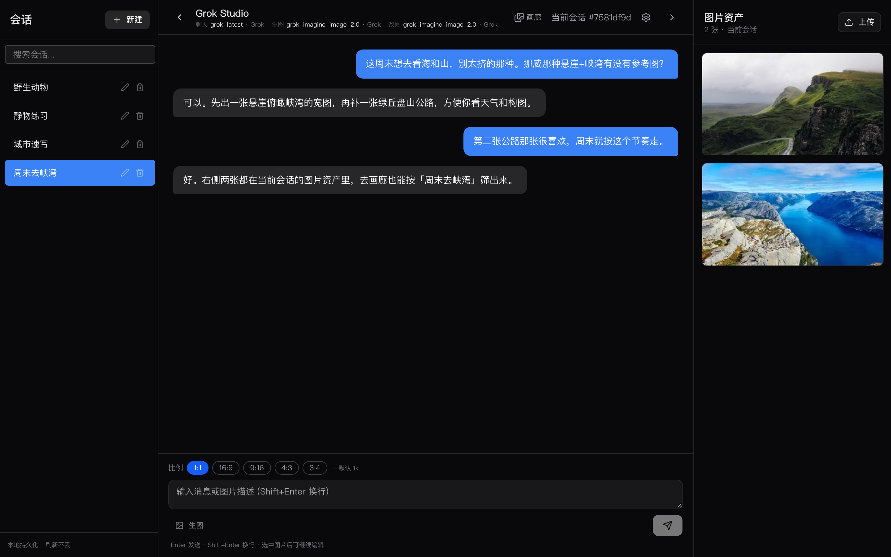
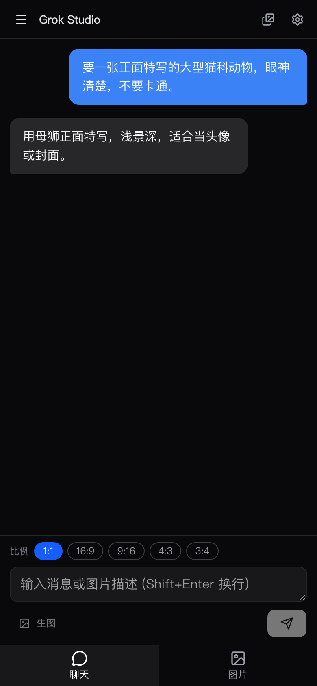
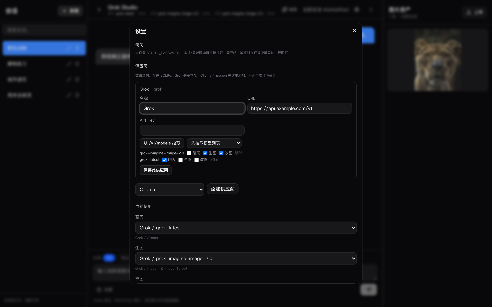
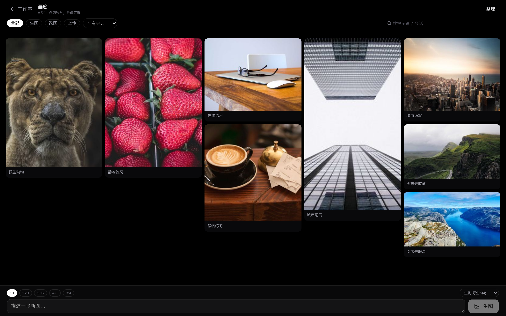
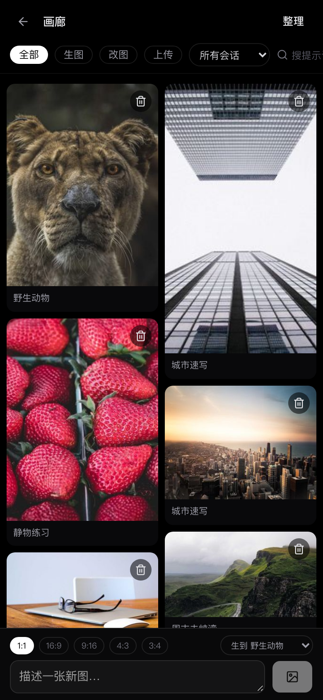

# 用户手册

这是给人用的说明。怎么部署、怎么改代码，看 [README](../README.md) 和 [开发者说明](./develop.md)。

下面截图来自一份**独立样例数据**（风景、静物、建筑），不是任何人的真实聊天记录，也碰不到你机器上的 `data/`。图源是 [Lorem Picsum](https://picsum.photos/) 的公开照片。

## 打开之后

默认是工作室：左会话、中聊天、右当前会话的图。

顶栏能看到当前绑的聊天 / 生图 / 改图后端，右边齿轮是设置，「画廊」看全部作品。

手机上会话列表收进左上角菜单，底栏在「聊天」和「图片」之间切。

## 第一次用

1. 按 README 把项目跑起来（`pnpm dev` 或 Docker）
2. 打开 http://localhost:3000
3. 点齿轮，填至少一家供应商（Grok 是基本盘）
4. 拉模型列表，勾选能力，再在「当前使用」里绑定聊天 / 生图 / 改图 / 朗读

供应商存在 SQLite 里，不必把每家的 Key 都堆进环境变量。环境变量只适合开机种子（比如第一次的 Grok 地址）。设置标题旁是当前版本号，随缘升级时看一眼就行。

可选：`.env.local` 里设 `STUDIO_PASSWORD`，局域网谁来都先登录。不设就谁能连上端口谁能用。

## 聊天

- 左侧「新建」开会话，点标题进入
- Enter 发送，Shift+Enter 换行
- 聊到大约 20 条会自动压摘要，下次请求带着走（方便命中缓存）
- 编辑一条用户消息会截断它后面的内容再生成
- 助手消息可以重试，不会再插一条用户消息
- 标题旁边的笔是重命名，垃圾桶删除会话

聊天和画图不要绑同一个模型。

## 生图 / 改图

输入框上面选比例和画质（512 / 1K / 2K）。默认值在设置 → 生图里改。

- **生图**：写描述，点「生图」。图会进当前会话的右侧栏，并立刻存到本机
- **改图**：先在右侧点一张图选中，再写改图指令，点「改图」。Imagen 只能生图，改图会走 Grok
- 点缩略图可以放大、下载、旋转、删除
- 中转站给的图 URL 会过期，所以生成后马上会落到 `data/images/`
- 2K 看当前模型支不支持；不认就换回 1K

## 画廊

打开 http://localhost:3000/gallery ，或顶栏「画廊」。

这是欣赏页，按会话分组，组里是瀑布流：

- 缩略图懒加载，滑到底再要下一页，图多的时候省流量
- 点进去先出缩略图再淡入原图
- 全屏左右键切图，可以改图、下载、旋转、删除
- 手机没开自动旋转时，横过来拿也会转图；也可以点旋转按钮
- 「去对话」跳回那个会话并打开这张图
- 底栏也能直接生图（选落到哪个会话）
- 「整理」可以多选删除

手机上一样能刷、能删、能转图。

## 朗读

设置里加 Qwen3TTS，从 `/v1/audio/voices` 拉音色，把「朗读」绑上。

- 助手消息上可以点朗读，`wav` 边收边播
- 播完存在 `data/audio/`，同一条再点就重播缓存
- `0.6b-custom-*` 才有 vivian 这类固定音色
- `0.6b-base-clone-*` 只有 `dynamic`：先上传 3–10 秒参考音频生成音色，再绑定

## 备份

拷整个 `data/` 目录。里面有：

- `grok-studio.db` 会话、消息、供应商、绑定
- `images/` `thumbs/` 原图和缩略图
- `audio/` 朗读缓存
- `voices/` 克隆音色

不要和 Docker、`pnpm dev` 同时开同一个库（SQLite 会抢锁）。

## 常见问题

**页面打不开，容器其实在跑**  
Docker 里服务要监听 `0.0.0.0`。绑 `::` 时 OrbStack 经常转不进 `localhost:3000`。

**画廊是空的**  
图挂在会话上。先在某个会话里生图，或去画廊底栏生。

**改图按钮是灰的**  
当前改图后端不支持。把「改图」绑到 Grok。

**设置里拉不到模型**  
URL 要填到 `/v1` 这一层，例如 `https://xxx/v1`，不要多也不要少。

**版本号在哪**  
设置标题旁边，以及 `GET /api/health` 的 `version` 字段。随缘升级时对一下就知道装的是哪一版。
