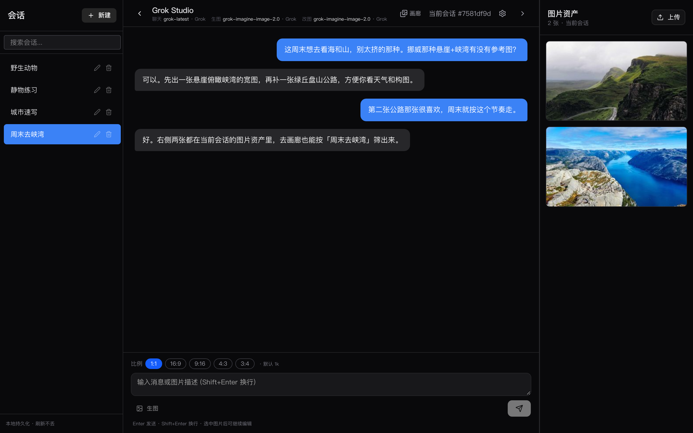
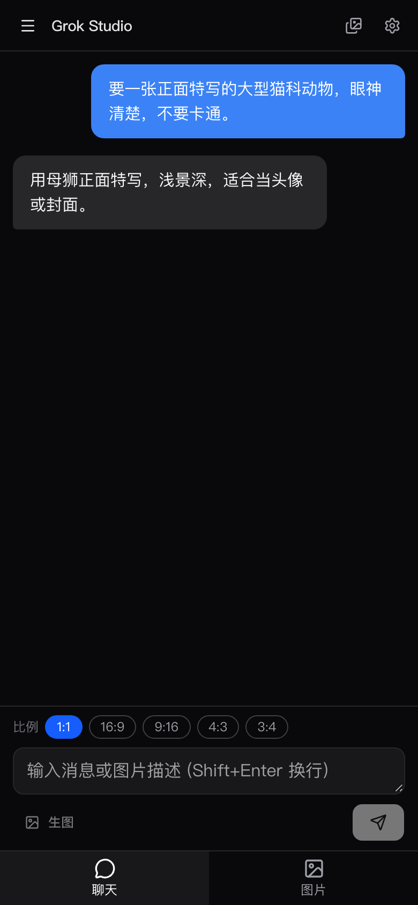
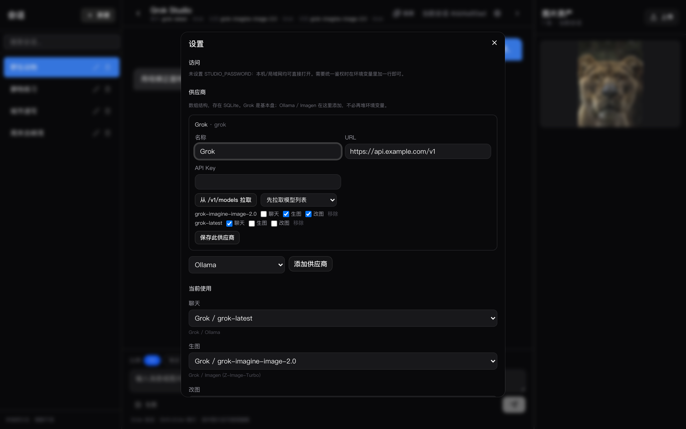
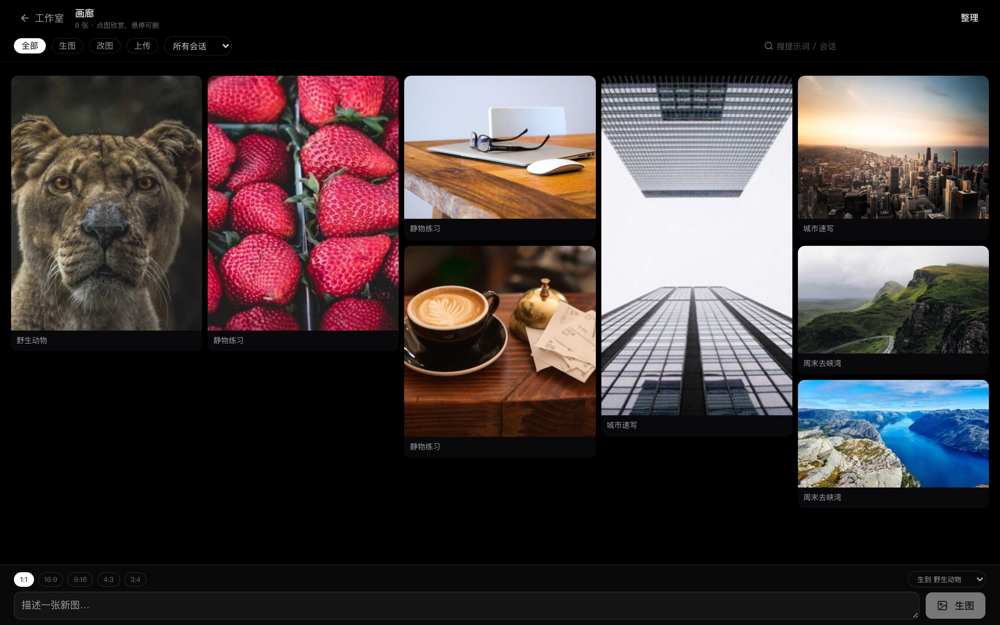
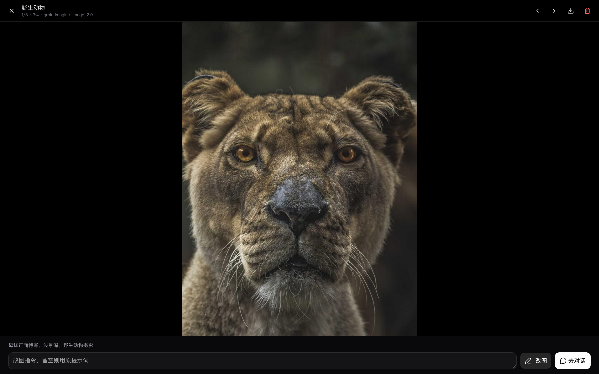
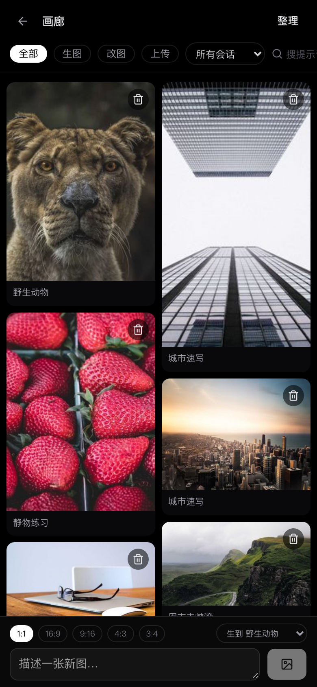

# 用户手册

这是给人用的说明。应用顶栏的「手册」打开的就是这一页。怎么部署、怎么改代码，看仓库里的 README 和 `docs/develop.md`。

下面截图来自一份**独立样例数据**（风景、静物、建筑），不是任何人的真实聊天记录，也碰不到你机器上的 `data/`。图源是 [Lorem Picsum](https://picsum.photos/) 的公开照片。

## 打开之后

默认是工作室：左会话、中聊天、右当前会话的图。

顶栏能看到当前绑的聊天 / 生图 / 改图后端。旁边「手册」就是这一页，「画廊」看全部作品，齿轮是设置。

手机上会话列表收进左上角菜单，底栏在「聊天」和「图片」之间切。

## 第一次用

1. 按 README 把项目跑起来（`pnpm dev` 或 Docker）
2. 打开 http://localhost:3000
3. 点齿轮，填至少一家供应商（Grok 是基本盘）
4. 拉模型列表，勾选能力，再在「当前使用」里绑定聊天 / 生图 / 改图 / 朗读

供应商存在 SQLite 里，不必把每家的 Key 都堆进环境变量。环境变量只适合开机种子（比如第一次的 Grok 地址）。设置标题旁是当前版本号，随缘升级时看一眼就行。

可选：`.env.local` 里设 `STUDIO_PASSWORD`，局域网谁来都先登录。不设就谁能连上端口谁能用。

## 聊天

- 左侧「新建」开会话，点标题进入
- Enter 发送，Shift+Enter 换行
- 聊到大约 20 条会自动压摘要，下次请求带着走（方便命中缓存）
- 编辑一条用户消息会截断它后面的内容再生成
- 助手消息可以重试，不会再插一条用户消息
- 标题旁边的笔是重命名，垃圾桶删除会话。删的是对话，图留在画廊

聊天槽绑文本模型，生图槽绑生图模型，两边不要绑成同一个。

聊天槽是 Grok 时，模型可以在对话里直接画，也可以接着改刚才的图：

- 它自己决定什么时候画。助手消息里出缩略图，右侧栏和画廊同时有
- 记下的提示词是模型写给生图的那一句，另外有比例、分辨率、尺寸和模型名
- 后面说「改暗一点」这类话，它能改最近几张
- 输入框上的「生图 / 改图」仍走单独绑的后端，比例和画质在输入框上面选
- 中转站没有 `/v1/responses` 时，这一次退回纯文字，聊天不断
- Ollama 只聊天，不会在对话里画

## 生图 / 改图

输入框上面选比例和画质（512 / 1K / 2K）。默认值在设置 → 生图里改。

- **生图**：写描述，点「生图」。图会进当前会话的右侧栏，并立刻存到本机
- **改图**：先在右侧点一张图选中，再写改图指令，点「改图」。Imagen 只能生图，改图会走当前绑的改图后端（默认 Grok）
- **ComfyUI / Qwen Image 2.1**：设置里加供应商，URL 填 ComfyUI 根地址（本机常见 `http://127.0.0.1:8188`）。生图和改图都绑到 `qwen-image-2.1`。正向用完整的句子，写清是一个人、全身还是半身、两只手各自在做什么、每只手五根手指。全身用 9:16，方图会把人缩得很小，手指容易糊。这套模型 CFG 固定为 1，没有单独的负向框；想避免多手，把「每只手五根手指、画面里只有一个人」写进正向。一次只改一件事，两个人叠在一起容易多出手。种子和步数在供应商的「高级配置」里，空着就是每次随机种子、20 步。简单站姿可以把步数改成 8。选中一张图后，强度条只出现在「改图」旁边，默认 0.85，这一次用你拨到的数。发送和生图不看这个数。刻度只是参考：0 是参考图，适合改颜色和背景；0.5 左右只动领口、表情；0.85 换衣服、换场景；拉到头接近换姿态、换人。高级配置里的重绘是不打开强度条时的默认值。参考图模式不改原图尺寸；画质按钮在那种模式下决定大概像素量，比例仍跟着原图
- **ComfyUI / Anima**：还是同一个 ComfyUI 供应商。设置里会有 `anima`，也可以从扩散模型列表把实际权重名勾进来，名字里带 anima 就会用 Anima。提示词写得越具体越好。默认 32 步、euler、调度器 sgm_uniform、CFG 4。想要更细可以把步数改成 50。这台机器上的文件是 CLIP `qwen_3_06b_base.safetensors`（类型 `stable_diffusion`）、VAE `qwen_image_vae.safetensors`、UNet `Anima-2.9B-preview-v1.safetensors`。改图没有参考图节点，强度要大于 0，走重绘。
- 图默认打码。顶栏「原图」只对当前浏览器会话生效，关掉标签就恢复打码。打码时下载到的也是马赛克
- 点缩略图可以放大、下载、旋转、删除
- 中转站给的图 URL 会过期，所以生成后马上会落到 `data/images/`
- 2K 看当前模型支不支持；不认就换回 1K

## 画廊

打开 http://localhost:3000/gallery ，或顶栏「画廊」。

这是欣赏页，按会话分组，组里是瀑布流：

- 缩略图懒加载，滑到底再要下一页，图多的时候省流量
- 点进去先出缩略图再淡入原图
- 全屏左右键切图，可以改图、下载、旋转、删除
- 手机没开自动旋转时，横过来拿也会转图；也可以点旋转按钮
- 「去对话」跳回那个会话并打开这张图。会话已经删掉时没有这一项
- 筛选里的「未归类」是删掉会话后留下的图，原文件还在 `data/images/`
- 更早以前删会话时，库里的记录被清掉、文件还在。服务起来后第一次打开画廊会把这些文件补登记进来，提示词当时没留下，就是空的
- 底栏也能直接生图（选落到哪个会话）
- 「整理」可以多选删除

手机上一样能刷、能删、能转图。

## 朗读

设置里加 Qwen3TTS，从 `/v1/audio/voices` 拉音色，把「朗读」绑上。

- 助手消息上可以点朗读，`wav` 边收边播
- 播完存在 `data/audio/`，同一条再点就重播缓存
- `0.6b-custom-*` 才有 vivian 这类固定音色
- `0.6b-base-clone-*` 只有 `dynamic`：先上传 3–10 秒参考音频生成音色，再绑定

## 备份

拷整个 `data/` 目录。里面有：

- `grok-studio.db` 会话、消息、供应商、绑定
- `images/` `thumbs/` 原图和缩略图
- `audio/` 朗读缓存
- `voices/` 克隆音色

不要和 Docker、`pnpm dev` 同时开同一个库（SQLite 会抢锁）。

## 常见问题

**页面打不开，容器其实在跑**  
Docker 里服务要监听 `0.0.0.0`。绑 `::` 时 OrbStack 经常转不进 `localhost:3000`。

**画廊是空的**  
先在某个会话里生图，让 Grok 在聊天里画，或去画廊底栏生。删掉的会话，图在筛选里的「未归类」。

**改图按钮是灰的**  
当前改图后端不支持。把「改图」绑到 Grok 或 ComfyUI。

**设置里拉不到模型**  
URL 要填到 `/v1` 这一层，例如 `https://xxx/v1`，不要多也不要少。

**版本号在哪**  
设置标题旁边，以及 `GET /api/health` 的 `version` 字段。随缘升级时对一下就知道装的是哪一版。
